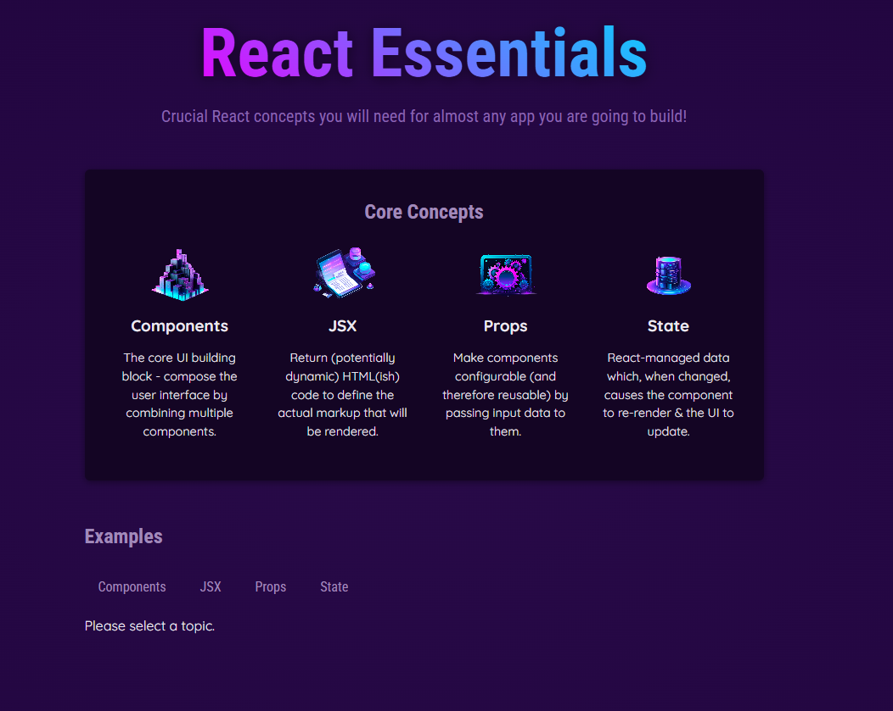

# 🚀 React Essentials – Core Concepts

A simple and visual **React practice project** introducing the core building blocks of modern React development: `Components`, `JSX`, `Props`, and `State`.

This project is part of my [Udemy React Course 2025](https://github.com/al-badarin/UDEMY-React-Course-2025).  
It’s a beginner-friendly introduction with interactive examples and explanations.



---

## 📺 Demo Preview

[](https://youtu.be/-UEtNS4caYk)  

---

## 🧠 What I learned and applied

- 🔹 **Components**: Creating reusable building blocks for the UI
- 🔹 **JSX**: Writing HTML-like code inside JavaScript
- 🔹 **Props**: Passing data into components
- 🔹 **State**: React's way of managing dynamic data in the UI
- 🔹 **Event Handling**: Basic interaction logic with buttons

---

## 🛠 Tech Stack

| Technology                                                                        | Description                                          |
| --------------------------------------------------------------------------------- | ---------------------------------------------------- |
|                  | JavaScript library for building user interfaces      |
|  | Logic and interactivity                              |
|        | HTML-like syntax used in React                       |
|                 | Structure of the page                                |
|                    | Styling the UI                                       |
|                | Development build tool for fast refresh & dev server |

---

## ⚙️ Installation & Running

Make sure you have Node.js and npm installed.

```bash
npm install
npm run dev
```
