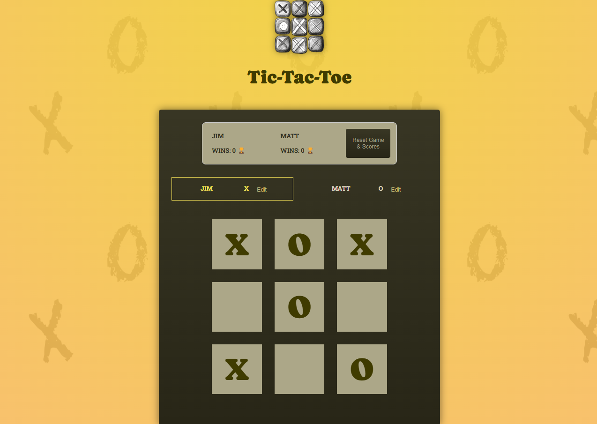

# 🎯 Tic-Tac-Toe Game – React Essentials Deep Dive

A beginner-friendly **React practice project** exploring essential React concepts such as `Components`, `JSX`, `State`, `Props`, and `Conditional Rendering`.

This is part of the [React Projects](https://github.com/al-badarin/React-Projects) series, where I experiment with fun and educational React-based builds.



---

## 🌐 Live Demo

[](https://tic-tac-toe-albadarin.netlify.app/)

Fully responsive across all screen sizes – desktop, tablet, and mobile 📱

---

## 🧠 What I learned and applied

- **Dynamic Components**: Splitting logic between Player, GameBoard, Log, GameOver, and ScoreBoard
- **React State Management**: Tracking turns, winners, and scores
- **Persistent State**: Using `localStorage` to save scores and player names
- **Immutability**: Avoiding direct mutations of the game board
- **Derived State**: Using helper functions to compute game logic like active player or winner
- **Controlled Inputs**: Editable player names via input fields
- **Conditional Rendering**: Displaying winner/draw messages dynamically
- **Responsive Design**: Mobile-first CSS adjustments and flexbox

---

## 🛠 Tech Stack

| Technology                                                                        | Description                        |
| --------------------------------------------------------------------------------- | ---------------------------------- |
|                  | JavaScript library for building UI |
|  | Core game logic and interactivity  |
|        | HTML-like syntax used in React     |
|                | Static structure and layout        |
|                    | Component-specific styling         |
|                | Build tool for fast dev refresh    |

---

## 📁 Project Structure

```txt
src/
├── components/
│   ├── GameBoard/           # Main 3x3 board rendering
│   ├── GameOver/            # Game over message + rematch
│   ├── Log/                 # Move log (who played where)
│   ├── Player/              # Player name editor + active highlight
│   └── ScoreBoard/          # Player score tracking + reset functionality
├── assets/                  # Game logo or visuals
├── App.jsx                  # Main game logic and composition
├── winning-combinations.js  # Contains winning line logic
├── index.jsx                # React root entry point
└── index.css                # Global styles
```

---

## ✨ New Functionality Added

- ✅ Player **score tracking** for each win
- 🔁 **Reset** button clears scores and player names
- 💾 Scores and player names are saved in `localStorage`
- 💡 Extracted reusable **ScoreBoard** component
- 📱 Fully **responsive UI** across mobile and tablet

---

## 🧩 Game Logic Summary

- Two players (X & O) take turns clicking grid squares
- First to match 3 in a row/column/diagonal wins
- Players can rename themselves
- Move log tracks each turn
- Game ends on win or draw and offers a rematch

---

## ⚙️ Getting Started

Make sure you have **Node.js** and **npm** installed.

### 🧪 Install Dependencies

```bash
npm install
npm run dev
```

---

Happy coding! 🚀
