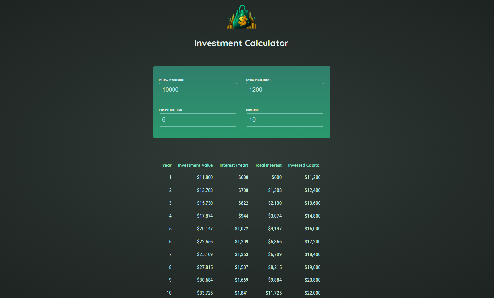

# 🎯 [React Investment Calculator](https://investment-calculator-albadarin.netlify.app/)

A beginner-friendly **React project** that helps visualize **compound interest over time** based on user inputs like initial investment, expected return, and duration. It’s designed to reinforce core React concepts such as `useState`, `Component Composition`, `Event Handling`, and `Derived State`.

This is part of the [React Projects](https://github.com/al-badarin/React-Projects) series, where I experiment with fun and educational React-based builds.



---

## 🌐 Live Demo

[](https://investment-calculator-albadarin.netlify.app/)

Fully responsive across all screen sizes – desktop, tablet, and mobile 📱

---

## 📺 Demo Preview

[](https://youtu.be/8QSrQqaPd3s)

---

## 🧠 What I learned and applied

* **State Management with `useState`**: Tracking investment form inputs
* **Dynamic Event Handling**: Form inputs updating state dynamically
* **Derived State Calculations**: Yearly growth, interest, and totals computed based on inputs
* **Conditional Rendering**: Validating duration input for logical output
* **Reusable Components**: `Header`, `UserInput`, `Results`
* **Table Formatting**: Rendering compound interest data over multiple years
* **Number Formatting**: Leveraged `Intl.NumberFormat` API for currency
* **Modular File Structure**: Separated concerns into utility and component layers

---

## 🛠️ Tech Stack

| Technology                                                                        | Description                           |
| --------------------------------------------------------------------------------- | ------------------------------------- |
|                  | JavaScript library for building UI    |
|  | Core investment logic & interactivity |
|        | HTML-like syntax used in React        |
|                | Markup structure                      |
|                     | Scoped component styling              |
|                | Fast dev server & hot reload          |

---

## 📁 Project Structure

```txt
src/
├── components/
│   ├── Header/               # Title banner
│   ├── UserInput/            # Input form for financial parameters
│   └── Results/              # Output table of yearly growth
├── util/
│   └── investment.js         # Core calculation & formatting functions
├── App.jsx                   # Core logic, state handling & component composition
├── main.jsx                  # React DOM entry point
└── index.css                 # Global styles
```

---

## ✨ Key Features

* ✅ Real-time **compound interest** projections
* ✅ Clear **visual table** of investment performance
* ✅ Editable form with default values
* ❌ Input validation with error messaging
* 📈 **Currency formatting** for all values
* 📊 Clean and modular architecture
* 📱 **Responsive design** for any screen

---

## ⚙️ Getting Started

Ensure you have **Node.js** and **npm** installed.

### 🔪 Install Dependencies

```bash
npm install
npm run dev
```

---

## 📄 Repo & Resources

* GitHub: [React Investment Calculator](https://github.com/al-badarin/React-Projects/tree/main/03-Investment-Calculator)
* Live Site: [investment-calculator-albadarin.netlify.app](https://investment-calculator-albadarin.netlify.app/)
* YouTube Walkthrough: [Watch on YouTube](https://youtu.be/8QSrQqaPd3s)
