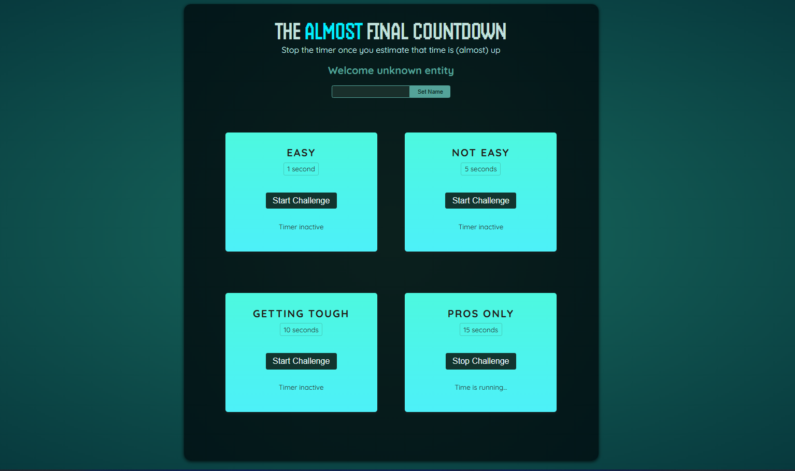

# ⏳ [React Countdown Game](https://countdown-game-albadarin.netlify.app/)

A fun, interactive **React project** that challenges your reflexes!  
Stop the timer **as close as possible** to the target time without going over. This project reinforces core React concepts like `useState`, `useRef`, `forwardRef`, `Portals`, and component composition — all while making learning feel like a game.

This is part of the [React Projects](https://github.com/al-badarin/React-Projects) series, where I experiment with fun and educational React-based builds.



---

## 🌐 Live Demo

[](https://countdown-game-albadarin.netlify.app/)

Fully responsive across all screen sizes – desktop, tablet, and mobile 📱

---

## 📺 Demo Preview

[](https://youtu.be/G-_dulIs0ZQ)

---

## 🧠 What I learned and applied

- **Refs with `useRef`**: Controlling DOM elements & storing timer IDs
- **Imperative Handle with `forwardRef`**: Exposing component methods to parent components
- **Portals (`createPortal`)**: Rendering modals outside the main DOM hierarchy
- **State Management (`useState`)**: Tracking remaining time and player name
- **Conditional Rendering**: Switching between timer states & results
- **Dynamic Component Props**: Passing target times and titles to multiple `TimerChallenge` instances
- **Reusable Components**: `Player`, `TimerChallenge`, `ResultModal`
- **Scoped Styling**: Component-specific CSS files
- **User Interaction Flow**: Start, stop, reset cycle with win/lose feedback

---

## 🛠️ Tech Stack

| Technology                                                                        | Description                        |
| --------------------------------------------------------------------------------- | ---------------------------------- |
|                  | JavaScript library for building UI |
|  | Core game logic & interactivity    |
|        | HTML-like syntax used in React     |
|                | Markup structure                   |
|                     | Scoped component styling           |
|                | Fast dev server & hot reload       |

---

## 📁 Project Structure

```txt
src/
├── assets/                    # Static assets
├── components/
│   ├── Player/                # Player name input & greeting
│   ├── ResultModal/           # Modal displaying game results
│   └── TimerChallenge/        # Timer game logic & UI
├── App.jsx                    # Main component composition
├── main.jsx                   # React DOM entry point
└── index.css                  # Global styles
```
