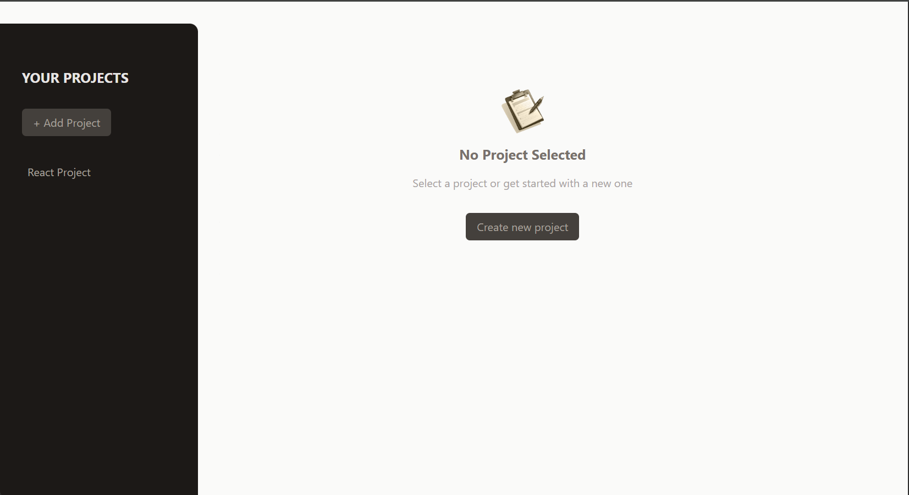
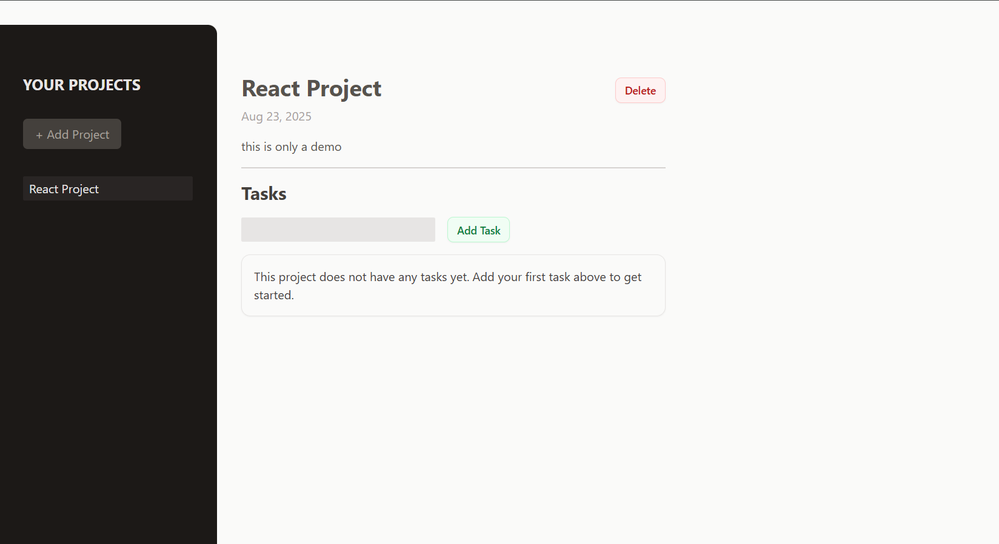

# 🗂️ React Project Management App

A minimal, fast **React + Vite + Tailwind** app to manage projects and their tasks. Create a project, add tasks, and focus on one selected project while keeping all projects accessible from the sidebar.

This project is part of the **React Projects** series.




---

## 🌐 Live Demo

[](https://project-manager-app-albadarin.netlify.app/)

Fully responsive across desktop, tablet, and mobile 📱

---

## 📺 Demo Preview

[](https://youtu.be/e5zPqO4NAXU)

---

## ✨ Features

- **Projects sidebar** with quick selection
- **Create new project** via modal form
- **Add tasks** to the selected project
- **Graceful empty state** when no project is selected
- **Reusable UI primitives**: `Button`, `Input`, `Modal`
- **Responsive layout** powered by Tailwind CSS

> Note: State is managed client‑side for simplicity and can be adapted to a backend or local storage.

---

## 🧠 What I learned and applied

- **State management (`useState`)** and state lifting across components
- **Portals (`createPortal`)** for the `Modal` component
- **Component Composition** with focused responsibilities
- **Form handling & basic validation** for project and task creation
- **Conditional rendering** for selected vs. empty project views
- **Tailwind utility styling** for rapid UI development

---

## 🛠️ Tech Stack

| Technology                                                                        | Description               |
| --------------------------------------------------------------------------------- | ------------------------- |
|                    | UI library                |
|  | App logic & interactivity |
|        | Component markup          |
|     | Utility‑first styling     |
|                | Dev server & build tool   |

---

## 📁 Project Structure

```txt
05-project-management-app/
├── public/
├── src/
│   ├── assets/
│   ├── components/
│   │   ├── Button.jsx
│   │   ├── Input.jsx
│   │   ├── Modal.jsx
│   │   ├── NewProject.jsx
│   │   ├── NewTask.jsx
│   │   ├── NoProjectSelected.jsx
│   │   ├── ProjectsSidebar.jsx
│   │   ├── SelectedProject.jsx
│   │   └── Tasks.jsx
│   ├── App.jsx
│   ├── index.css
│   └── main.jsx
├── index.html
├── package.json
├── postcss.config.js
├── tailwind.config.js
└── vite.config.js
```

**Key Components**

- `ProjectsSidebar` – Lists projects and handles selection
- `SelectedProject` – Details & tasks for the active project
- `NewProject` – Create project form
- `Tasks` & `NewTask` – Task list & input for the current project
- `Modal`, `Button`, `Input` – Reusable UI building blocks
- `NoProjectSelected` – Empty state view

---

## 🚀 Getting Started

### 1) Clone & Install

```bash
# Clone the repository
git clone https://github.com/al-badarin/React-Projects.git
cd React-Projects/05-project-management-app

# Install dependencies
npm install
```

### 2) Run Dev Server

```bash
npm run dev
```

### 3) Build & Preview

```bash
npm run build
npm run preview
```

> Requires a recent Node.js (LTS) version.

---
