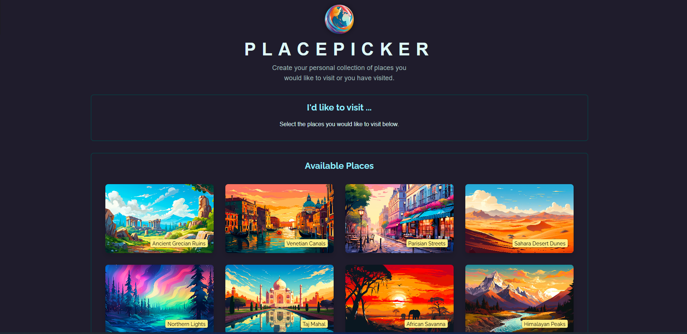

# 📍 React Place Picker

A snappy **React + Vite** app to curate your personal list of places. It **sorts nearby locations by distance** using your current geolocation, lets you **pick favorites**, and provides a **modal delete-confirmation** with an auto-confirm **progress bar**.

This project is part of the **React Projects** series.



---

## 🌐 Live Demo

[](https://place-picker-albadarin.netlify.app/)

Responsive across desktop, tablet, and mobile 📱

> The app requests **Location** permission to sort places by proximity.

---

## 📺 Demo Preview

[](https://youtu.be/UA8tKCopboo)

---

## ✨ Features

- **Geolocation sorting**: Orders “Available Places” by distance (Haversine formula).
- **Pick & manage** your places: Add to “I’d like to visit…” with one click.
- **Delete confirmation modal** with **auto-confirm after 3s** and a visual **ProgressBar**.
- **LocalStorage persistence** so selections survive page reloads.
- **Portal-based Modal** using native `<dialog>` for clean layering.
- **Graceful empty states** & loading fallback messages.

> Note: All state is managed client-side for simplicity.

---

## 🧠 What I learned and applied

- **Browser Geolocation API** + custom **distance sorting** (Haversine).
- **Portals** + native `<dialog>` for accessible modals.
- **Effects & refs** to imperatively control dialogs and timers.
- **Derived & persisted state** via `localStorage` (avoid duplicating data).
- **List rendering & keys**, component composition, fallback UI patterns.

---

## 🛠️ Tech Stack

| Technology                                                                        | Description               |
| --------------------------------------------------------------------------------- | ------------------------- |
|                    | UI library                |
|  | App logic & interactivity |
|        | Component markup          |
|                     | Styling                   |
|                | Dev server & build tool   |

---

## 📁 Project Structure

```txt
07-place-picker/
├── public/
├── src/
│   ├── assets/
│   │   └── logo.png
│   ├── components/
│   │   ├── DeleteConfirmation.jsx
│   │   ├── Modal.jsx
│   │   ├── Places.jsx
│   │   └── ProgressBar.jsx
│   ├── App.jsx
│   ├── data.js
│   ├── index.css
│   ├── loc.js
│   └── main.jsx
├── index.html
├── package.json
└── vite.config.js
```

**Key Components & Flow**

- `App` – Orchestrates geolocation sorting, selected places, and modal state.

- `Places` – Renders category lists with fallback text and click-to-select.

- `Modal` – Portal + native <dialog> controlled by open and onClose.

- `DeleteConfirmation` – Yes/No actions + auto-confirm in 3s (uses ProgressBar).

- `ProgressBar` – Visual countdown for the delete auto-confirm timer.

- `loc.js` – Haversine helpers and sortPlacesByDistance.

- `data.js` – Static list of available places (title, image, lat/lon).

## 🚀 Getting Started

### 1) Clone & Install

```bash
# Clone the repository

git clone https://github.com/al-badarin/React-Projects.git
cd React-Projects/07-place-picker

# Install dependencies

npm install
```

```bash
### 2) Run Dev Server

npm run dev
```

```bash
### 3) Build & Preview

npm run build
npm run preview
```
